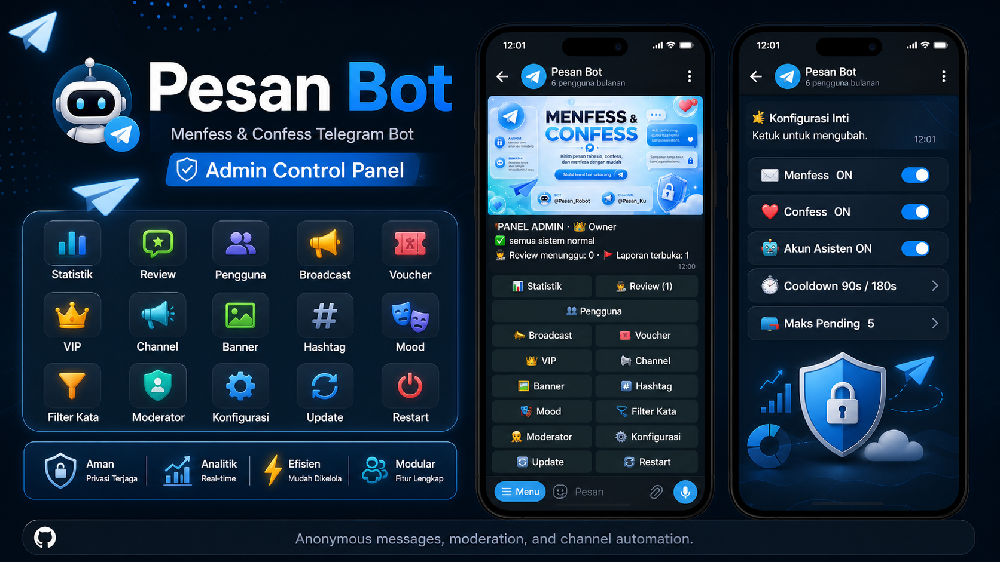

<div align="center">

# 🤫 Pesan Bot

### Tempat aman buat ngomong tanpa ketahuan



**Menfess** ke channel · **Confess** ke orangnya · **Balas anonim** dua arah — semuanya tanpa jejak identitas.

[](https://www.python.org/)
[](https://github.com/KurimuzonAkuma/pyrogram)
[](https://www.mongodb.com/)
[](LICENSE)
[](https://github.com/dlrmas/pesanbot/stargazers)

**Suka repo ini? Tinggalkan ⭐ — itu sangat berarti!**

</div>

---

## 💭 Ada yang sulit diucapkan?

Kadang ada kalimat yang cuma berani kamu kirim kalau tidak ada yang tahu itu kamu — rasa suka yang dipendam, unek-unek, ucapan terima kasih, atau sekadar cerita.

**Pesan Bot memberi ruang itu.** Tulis sekali, kirim anonim, lega — identitasmu urusan kami yang jaga.

## ⚡ Cara Kerja

> Semua pesan selalu lewat **preview** dulu. Tidak ada yang terkirim sebelum kamu menekan **Kirim**.

**✉️ Menfess** — tampil anonim di channel
```
Tulis pesan  →  Lihat preview  →  Tampil di channel (tanpa nama)
```

**💌 Confess** — langsung ke orangnya, gratis
```
Pilih target  →  Tulis pesan  →  Bot antar anonim  →  Dia bisa balas
```
Penerima bisa membalas **tanpa tahu siapa kamu** — jadi obrolan dua arah yang sama-sama anonim, dan bisa dihentikan kapan saja.

## ✨ Kenapa Pesan Bot?

- 🔐 **Privasi sungguhan** — pesan **tidak pernah di-forward**, selalu dikirim ulang tanpa identitas. Nol jejak.
- 🎨 **Tampilan modern & bersih** — satu layar aktif per chat, tombol berwarna, banner yang bisa kamu atur. Bukan bot norak.
- 🛡️ **Aman & terjaga** — moderasi kata terlarang anti-akal-akalan + kontrol penuh buat penerima (jeda, tolak media, blokir).
- 🧩 **Panel admin lengkap** — kelola semuanya dari Telegram, bahkan update bot dari GitHub **tanpa SSH** (lihat poster di atas).
- ⚙️ **Open source & self-host** — punya bot sendiri, datamu di server sendiri.

## 🎯 Cocok untuk

- 📣 Akun **base / menfess** komunitas
- 🎓 **Confess** kampus, sekolah, atau circle pertemanan
- 💬 Kotak **saran/curhat anonim** untuk grup & komunitas
- 🤖 Siapa pun yang mau bot anonim **rapi, aman, dan bisa diandalkan**

## 🚀 Mulai Cepat

```bash
# 1) Pasang dependensi
pip3 install -r requirements.txt

# 2) Berjalan di latar belakang vps
apt install screen -y # kalau belum install screen 
screen -S pesanbot # nyalakan screen 

# 3) Konfigurasi
cp .env.example .env        # lalu isi (lihat tabel di bawah)

# 4) Jalankan 
python3 main.py
```

Isi `.env`:

| Variabel | Keterangan |
|---|---|
| `API_ID` / `API_HASH` | dari https://my.telegram.org |
| `BOT_TOKEN` | dari [@BotFather](https://t.me/BotFather) — **aktifkan Inline Mode** (`/setinline`) |
| `OWNER_IDS` | ID Telegram Owner Bot |
| `MONGO_URI` | URI MongoDB yang berjalan |
| `ASSISTANT_SESSION` | Gunakan String Pyrogram V2 |

Terakhir, buka bot → `/admin` → **📢 Channel** untuk menyambungkan channel menfess, dan **🖼 Banner** untuk memasang banner menu.

## 🔄 Update & Deploy

Owner menarik versi terbaru **langsung dari panel** (`/admin → 🔄 Update Bot`): `git fetch` → `merge --ff-only` → `pip install` → restart, lalu lapor saat online. Repo private? Bot meminta **token GitHub** (read-only *Contents*) yang **tidak pernah disimpan**.

<details>
<summary><b>Deploy via systemd / screen</b></summary>

**systemd** (disarankan) — restart bersih otomatis:

```ini
[Service]
Restart=always
WorkingDirectory=/root/pesan
ExecStart=/root/pesan/env/bin/python3 main.py
```

**screen / manual** — saat tidak di bawah supervisor, bot me-restart dirinya **di tempat** (PID & terminal tetap, tanpa proses hantu).
</details>

📑 Peta kode lengkap: **[maps.md](maps.md)**

## 🔐 Keamanan & Privasi

- Pesan pengguna **tidak pernah di-forward** — selalu dikirim ulang tanpa identitas.
- Saldo terpotong **hanya setelah pengiriman sukses**, idempoten via ledger `ref` unik.
- Target confess diperingatkan **tepat satu kali**; tolak/blokir selalu dihormati.
- Token update tidak disimpan; asisten auto-stop saat kena limit Telegram & memberi tahu Owner.

## 🤝 Kontribusi & Dukungan

Pull request, laporan bug, dan ide fitur sangat diterima. Kalau repo ini bermanfaat, **beri ⭐** atau ajak bergabung sebagai collaborator.

## 📄 Lisensi

Dirilis di bawah lisensi **[MIT](LICENSE)** © 2026 dlrmas — bebas dipakai, diubah, dan disebar (termasuk komersial), asalkan kredit hak cipta tetap dicantumkan.

## ⚠️ Penggunaan & Tanggung Jawab

- Proyek ini disediakan **apa adanya**, untuk **penggunaan yang sah**. Pengguna bertanggung jawab penuh atas cara menjalankan & memakai bot ini, termasuk mematuhi hukum yang berlaku dan [Ketentuan Layanan Telegram](https://telegram.org/tos).
- **Penulis & kontributor tidak bertanggung jawab** atas penyalahgunaan, kerugian, atau tindakan ilegal yang dilakukan pihak lain dengan software ini — lihat penafian penuh di [LICENSE](LICENSE).
- **Dilarang** memakai proyek ini untuk penipuan, spam, pelecehan, doxing, atau aktivitas melanggar hukum lainnya.
- Menemukan penyalahgunaan? Laporkan lewat [GitHub Issues](https://github.com/dlrmas/pesanbot/issues).

